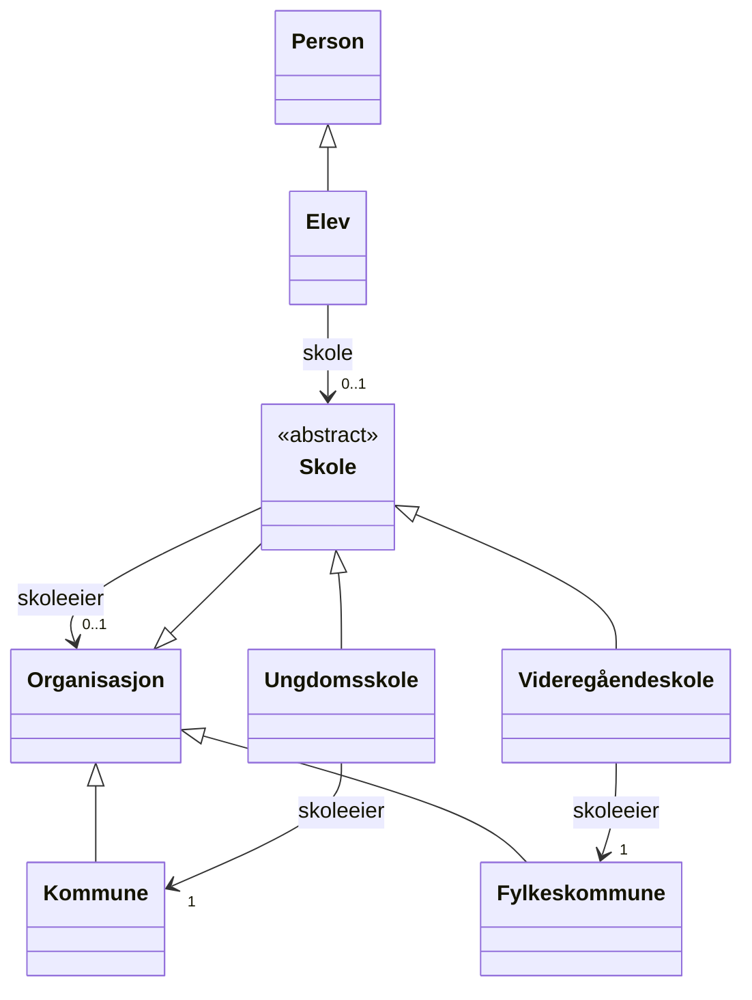

# Enkel domenemodell

```mermaid
classDiagram
    direction TB
    class c0["Elev"] {
    }
    class c1["Fylkeskommune"] {
    }
    class c2["Kommune"] {
    }
    class c3["Organisasjon"] {
    }
    class c4["Person"] {
    }
    class c5["Skole"] {
        <<abstract>>
    }
    class c6["Ungdomsskole"] {
    }
    class c7["Videregåendeskole"] {
    }

    c4 <|-- c0
    c3 <|-- c1
    c3 <|-- c2
    c3 <|-- c5
    c5 <|-- c6
    c5 <|-- c7

    c0 --> "0..1" c5 : skole
    c5 --> "0..1" c3 : skoleeier
    c6 --> "1" c2 : skoleeier
    c7 --> "1" c1 : skoleeier
```
